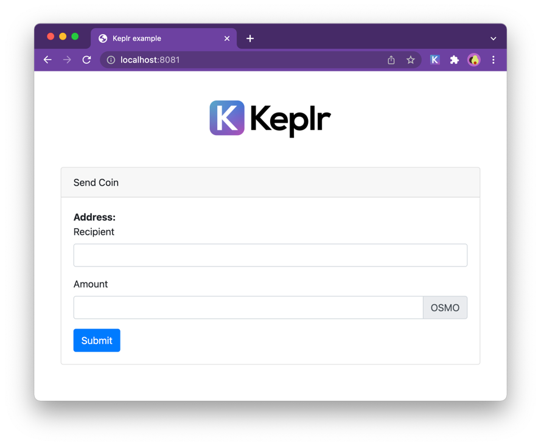

# Keplr Example
This is a simple example if how to Keplr extension injects the offline signer that is compatible with cosmJS. 

## Documentation

https://cosmos.github.io/cosmjs/latest/stargate/index.html


## Local Development

Test with node 19.8.0.

Before running the dev task you need to export the following variable:

```
export NODE_OPTIONS=--openssl-legacy-provider
```

Install dependencies

```
npm install

```

Run development Server
```
npm run dev
```

For more details see comments on `src/main.js`.

## Tests

TX Hash for transaction with memo:
https://www.mintscan.io/osmosis/txs/94B01B8FF9C99BF4A5454D3EFF31DD91FA42A7B61D48E0FCBCA915541858D446

TX Hash for delegation with memo:
https://www.mintscan.io/osmosis/txs/27F0794D0EB876E7AE1BAE35C35BD1406109117B3645F0DFB92546ABC3A9D4D9
